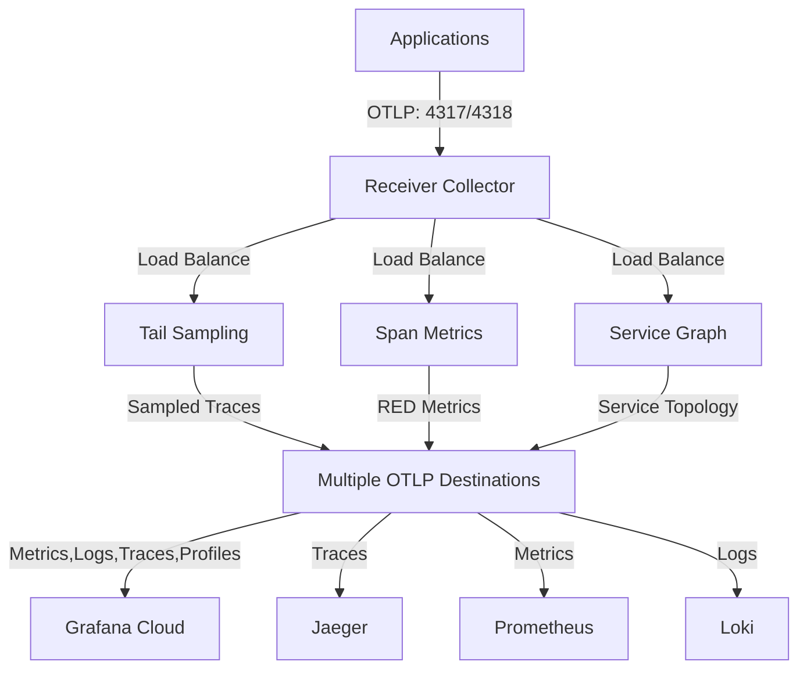

# OpenTelemetry Collector Stack

A scalable OpenTelemetry Collector Helm chart with multi-destination OTLP routing that enables sending traces, metrics, and logs to multiple backends simultaneously (Grafana Cloud, Jaeger, Loki, Prometheus, etc.) in Kubernetes environments.

## Features

✅ **Multi-Destination Support** - Send telemetry to multiple OTLP backends simultaneously  
✅ **Signal Routing** - Route traces, metrics, and logs to different destinations  
✅ **Flexible Authentication** - Per-destination authentication with Kubernetes secrets  
✅ **Advanced Processing** - Tail sampling, span metrics, service graphs  

## Architecture



## Quick Start

### Prerequisites
- Kubernetes 1.28+
- Helm 3.15+
- [Cert Manager](https://cert-manager.io/docs/installation/)
- [OpenTelemetry Operator](https://github.com/open-telemetry/opentelemetry-operator)

### Installation

0. **Install Cert Manager **:

```bash
kubectl apply -f https://github.com/cert-manager/cert-manager/releases/download/v1.19.1/cert-manager.yaml
```

1. **Install OpenTelemetry Operator**:
   ```bash
   kubectl apply -f https://github.com/open-telemetry/opentelemetry-operator/releases/latest/download/opentelemetry-operator.yaml
   ```

2. **Create authentication secrets**:
   ```bash
   kubectl create namespace o11y
   kubectl create secret generic grafana-auth \
     --from-literal=username="YOUR_USERNAME" \
     --from-literal=password="YOUR_TOKEN" -n o11y
   ```

3. **Deploy the chart**:
   ```bash
   cd otel-collectors
   helm install otel-collectors . -f values.yaml -n o11y
   ```

## Configuration

### Multi-Destination Setup

```yaml
otlpDestinations:
  grafanaCloud:
    enabled: true
    endpoint: "https://otlp-gateway.grafana.net/otlp"
    authSecretName: "grafana-auth"
    signals: ["traces", "metrics", "logs"]
    
  jaeger:
    enabled: true
    endpoint: "http://jaeger:4318"
    authSecretName: "jaeger-auth"
    signals: ["traces"]
```

### Application Integration

Point your applications to the collector:
```bash
# gRPC OTLP
OTEL_EXPORTER_OTLP_ENDPOINT=http://otel-collectors-receiver-collector.o11y.svc.cluster.local:4317

# HTTP OTLP  
OTEL_EXPORTER_OTLP_ENDPOINT=http://otel-collectors-receiver-collector.o11y.svc.cluster.local:4318
```

## Documentation

See [docs/](docs/) for detailed configuration guides:
- [Multi-destination setup](docs/howto.md)
- [Tail sampling policies](docs/howto.md)
- [Transform processors](docs/howto.md)
- [Troubleshooting](docs/howto.md)

