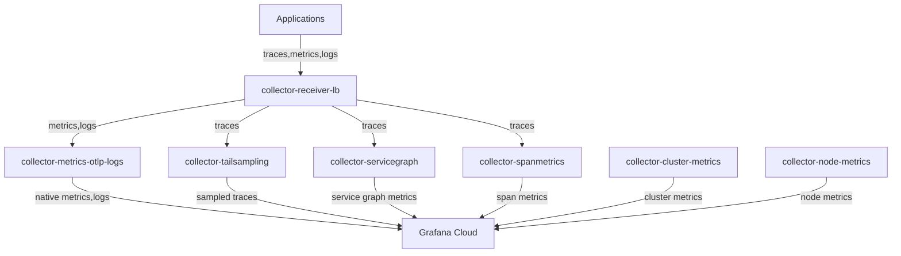

# OpenTelemetry Collector Architecture for Kubernetes Observability

This repository contains OpenTelemetry Collector configurations for a comprehensive Kubernetes observability stack deployed on AKS, sending data to Grafana Cloud.

## Architecture Overview

### Multi-Tier Collector Architecture



### Collector Components

#### 1. Trace Load Balancer (`collector-receiver.yaml` - deployed as `collector-receiver-lb`)
- **Purpose**: Entry point for all application traces
- **Deployment**: Single replica
- **Function**: 
  - Receives OTLP traces (gRPC:4317, HTTP:4318)
  - Enriches traces with Kubernetes attributes
  - Load balances to downstream collectors using routing strategies:
    - `traceID` routing for tail sampling and servicegraph
    - `service` routing for spanmetrics

#### 2. Tail Sampling (`collector-tailsampling.yaml`) 
- **Purpose**: Probabilistic sampling of traces
- **Deployment**: 2 replicas
- **Function**:
  - 50% probabilistic sampling
  - 10s decision wait
  - Exports sampled traces to Grafana Cloud

#### 3. Span Metrics (`collector-spanmetrics.yaml`)
- **Purpose**: Generate RED metrics from traces
- **Deployment**: 2 replicas  
- **Function**:
  - Receives traces via service-based load balancing
  - Generates span duration, count, and latency metrics
  - Filters and exports span metrics to Grafana Cloud

#### 4. Service Graph (`collector-servicegraph.yaml`)
- **Purpose**: Generate service topology metrics
- **Deployment**: 2 replicas
- **Function**:
  - Receives traces via traceID-based load balancing
  - Generates service-to-service relationship metrics
  - 60s flush interval for service graph generation
  - Exports service topology to Grafana Cloud

#### 5. Kubernetes Cluster Metrics (`collector-k8s-cluster.yaml`)
- **Purpose**: Cluster-level observability 
- **Deployment**: StatefulSet (1 replica)
- **Function**:
  - Scrapes kube-state-metrics with official Grafana allowlist
  - Scrapes kubelet metrics with official Grafana allowlist  
  - Scrapes cAdvisor container metrics
  - Collects k8s_cluster API metrics

#### 6. Kubernetes Node Metrics (`collector-k8s-nodes.yaml`)
- **Purpose**: Node-level resource metrics
- **Deployment**: DaemonSet (one per node)
- **Function**:
  - Collects kubeletstats from each node
  - Node/pod/container CPU, memory, disk metrics
  - Per-node resource utilization

## Load Balancing Strategies

| Collector | Routing Key | Purpose |
|-----------|-------------|---------|
| tailsampling | `traceID` | Ensures complete traces go to same instance for sampling decisions |
| servicegraph | `traceID` | Ensures complete traces go to same instance for relationship analysis |
| spanmetrics | `service` | Distributes spans by service for metric generation |

## Deployment

### Prerequisites

#### [Opentelemetry Operator](https://github.com/open-telemetry/opentelemetry-operator)

```bash
kubectl apply -f https://github.com/open-telemetry/opentelemetry-operator/releases/latest/download/opentelemetry-operator.yaml
```
For GitOps approach see the other installation [options](https://github.com/open-telemetry/opentelemetry-helm-charts/tree/main/charts/opentelemetry-operator)
##### Grafana Cloud creds

```bash
apiVersion: v1
data:
  stack_password: YOUR_CLOUD_ACCESS_POLICY_PASSWORD
  stack_username: USERNAME
kind: Secret
metadata:
  name: dv-grafanacloud-auth

```

```bash
# Apply RBAC for cluster monitoring
kubectl apply -f rbac-k8s-cluster.yaml
# Deploy kube-state-metrics (required for cluster metrics)
kubectl apply -f kube-state-metrics.yaml
```

### Deploy Collectors
```bash
# Deploy in order:
kubectl apply -f application/*
```

## Configuration

### Environment Variables
Configure these via ConfigMap `dv-grafanacloud-settings` and Secret `dv-grafanacloud-auth`:

- `GRAFANA_OTLP_ENDPOINT` - Grafana Cloud OTLP endpoint
- `GRAFANA_USERNAME` - Grafana Cloud stack username  
- `GRAFANA_PASSWORD` - Grafana Cloud stack password
- `COLLECTOR_ENVIRONMENT` - Environment identifier
- `CLUSTER_NAME` - Kubernetes cluster name

### Application Integration

Applications should send traces to:
```
FQDN: collector-receiver-lb-collector.o11y.svc.cluster.local:4317 (gRPC)
FQDN: collector-receiver-lb-collector.o11y.svc.cluster.local:4318 (HTTP)
```

## Metrics Collected

### Traces & Application Metrics
- **Traces**: Distributed traces with 50% tail sampling
- **Span Metrics**: Duration, count, latency per service/operation  
- **Service Graph**: Service topology and request flow

### Kubernetes Infrastructure  
- **Cluster Metrics**: Deployments, pods, jobs, namespaces (via kube-state-metrics)
- **Node Metrics**: CPU, memory, disk utilization per node/pod/container
- **Kubelet Metrics**: Runtime operations, certificate status, volume stats

## Monitoring

Each collector exposes Prometheus metrics on port 8888:
```bash
kubectl port-forward -n o11y svc/collector-receiver-lb-collector-monitoring 8888:8888
```

Health checks available on port 13133 for each collector.

## Architecture Benefits

- **Scalability**: Dedicated collectors for different data types
- **Performance**: Optimized load balancing and resource allocation
- **Reliability**: Proper tail sampling and service discovery
- **Observability**: Complete trace, metric, and infrastructure monitoring
- **Standards Compliance**: Follows Grafana Cloud best practices and allowlists
