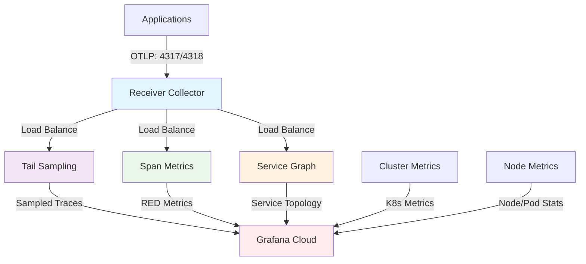

# OpenTelemetry Collector Operator Scalable Stack

A comprehensive Helm chart for deploying a production-ready, scalable OpenTelemetry Collector stack on Kubernetes with Grafana Cloud integration.

## 🏗️ Architecture Overview

This chart deploys a multi-tier OpenTelemetry Collector architecture optimized for high-throughput observability data processing:



## 🎯 Key Features

### 📊 **Application Observability**
- **Receiver**: Entry point with load balancing and trace enrichment
- **Tail Sampling**: Flexible, configurable sampling policies
- **Span Metrics**: RED metrics generation from traces
- **Service Graph**: Service topology and dependencies

### 🖥️ **Infrastructure Monitoring**
- **Cluster Metrics**: Kubernetes API metrics and kube-state-metrics
- **Node Metrics**: kubelet stats and resource utilization

### 🔧 **Advanced Configuration**
- **Transform Processors**: Configurable span name normalization per component
- **Flexible Policies**: Support for all OpenTelemetry tail sampling policy types
- **Component-Specific Configs**: Isolated configuration per collector

## 📦 Components

| Component | Purpose | Deployment | Resources |
|-----------|---------|------------|-----------|
| **receiver** | OTLP ingestion & load balancing | Deployment (1 replica) | 2Gi mem, 1 CPU |
| **tailsampling** | Smart trace sampling | StatefulSet (2 replicas) | 2Gi mem, 1 CPU |
| **spanmetrics** | RED metrics from traces | Deployment (1 replica) | 8Gi mem, 1 CPU |
| **servicegraph** | Service topology mapping | Deployment (1 replica) | 8Gi mem, 1 CPU |
| **cluster-metrics** | K8s cluster monitoring | StatefulSet (3 replicas) | 2Gi mem, 1 CPU |
| **node-metrics** | Node resource monitoring | DaemonSet | 256Mi mem, 200m CPU |

## 🚀 Quick Start

### Prerequisites

1. **OpenTelemetry Operator**
   ```bash
   kubectl apply -f https://github.com/open-telemetry/opentelemetry-operator/releases/latest/download/opentelemetry-operator.yaml
   ```

2. **Grafana Cloud Credentials**
   - Stack ID (username)
   - Access Policy Token (password) with OTLP write permissions

### Installation

1. **Clone and configure**
   ```bash
   git clone <this-repo>
   cd otelcollector-operator-scalable
   cp test-values.yml my-values.yml
   ```

2. **Update credentials in `my-values.yml`**
   ```yaml
   grafanaCloud:
     endpoint: "https://otlp-gateway-prod-eu-west-2.grafana.net/otlp"
     username: "YOUR_STACK_ID"
     password: "YOUR_ACCESS_POLICY_TOKEN"
     createSecret: true
   ```

3. **Deploy**
   ```bash
   helm upgrade --install otel-stack -f my-values.yml otel-helm-chart
   ```

### Application Integration

Configure your applications to send telemetry to:
```bash
# gRPC OTLP
OTEL_EXPORTER_OTLP_ENDPOINT=http://otel-stack-receiver-collector.o11y.svc.cluster.local:4317

# HTTP OTLP  
OTEL_EXPORTER_OTLP_ENDPOINT=http://otel-stack-receiver-collector.o11y.svc.cluster.local:4318
```

## ⚙️ Configuration

### Transform Processors

Configure span name normalization per component:

```yaml
applicationObservability:
  receiver:
    transform:
      traces:
        enabled: true
        transforms:
          span:
            - replace_pattern(span.name, "^GET /api/cart.*", "GET /api/cart")
            - replace_pattern(span.name, "^GET /api/users/\\d+", "GET /api/users/{id}")
  
  spanmetrics:
    transform:
      traces:
        enabled: true
        transforms:
          span:
            - replace_pattern(span.name, "^GET /media/.*", "GET /media/image")
```

### Tail Sampling Policies

Support for all OpenTelemetry policy types with complex nesting:

```yaml
applicationObservability:
  tailsampling:
    policies:
      enabled: true
      list:
        # Always sample errors
        - name: errors-always
          type: status_code
          status_code:
            status_codes: [ERROR]
        
        # Sample slow requests
        - name: slow-requests
          type: latency
          latency:
            threshold_ms: 2000
        
        # Complex AND policy
        - name: critical-service-errors
          type: and
          and:
            and_sub_policy:
              - name: service-filter
                type: string_attribute
                string_attribute:
                  key: service.name
                  values: [auth-service, payment-service]
              - name: error-filter
                type: status_code
                status_code:
                  status_codes: [ERROR]
        
        # Rate limiting
        - name: rate-limit-rest
          type: rate_limiting
          rate_limiting:
            spans_per_second: 100
        
        # Probabilistic fallback
        - name: sample-rest
          type: probabilistic
          probabilistic:
            sampling_percentage: 5
```

### Supported Policy Types

- `always_sample` - Always sample specific traces
- `latency` - Sample based on response time
- `numeric_attribute` - Sample based on numeric values
- `probabilistic` - Random percentage sampling
- `status_code` - Sample based on HTTP/gRPC status
- `string_attribute` - Sample based on string matching
- `rate_limiting` - Limit sampling throughput
- `span_count` - Sample based on trace complexity
- `trace_state` - Sample based on trace state
- `boolean_attribute` - Sample based on boolean flags
- `ottl_condition` - Sample using OTTL expressions
- `and` - Logical AND of multiple policies
- `composite` - Multiple evaluation criteria with ordering

