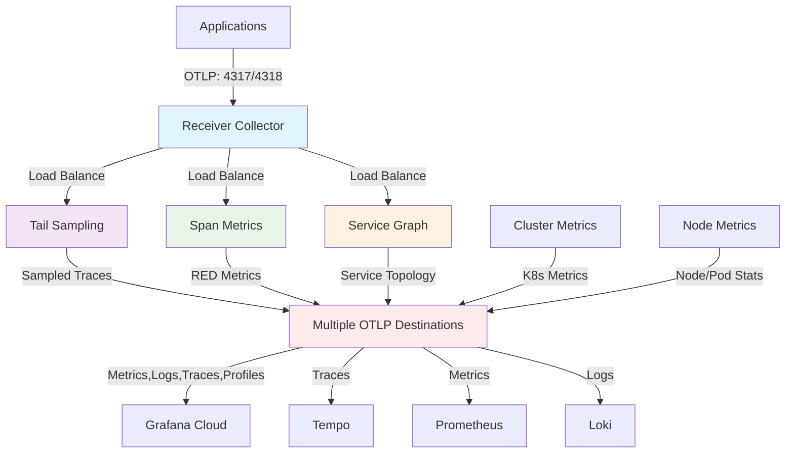

# OpenTelemetry Collector Stack Helm Chart

This Helm chart deploys a complete OpenTelemetry Collector stack for Kubernetes observability with support for multiple OTLP destinations including Grafana Cloud, Jaeger, Loki, Prometheus, and any OTLP-compatible backend.

## Architecture



- **Application Collectors**: Process traces and generate metrics
  - `collector-receiver` - OTLP trace receiver and load balancer
  - `collector-tailsampling` - Probabilistic trace sampling  
  - `collector-spanmetrics` - Generate RED metrics from traces
  - `collector-servicegraph` - Generate service topology metrics

- **Infrastructure Collectors**: Monitor Kubernetes infrastructure
  - `collector-k8s-cluster` - Cluster-wide metrics (StatefulSet)
  - `collector-k8s-nodes` - Node-level metrics (DaemonSet)

## Features

✅ **Multi-Destination Support**: Send telemetry to multiple OTLP backends simultaneously  
✅ **Signal Routing**: Route traces, metrics, and logs to different destinations  
✅ **Flexible Authentication**: Per-destination authentication with Kubernetes secrets  
✅ **Backward Compatibility**: Existing Grafana Cloud configurations work unchanged  
✅ **Production Ready**: Built-in resiliency, load balancing, and health checks  

## Prerequisites

- Kubernetes 1.28+
- Helm 3.15+
- OpenTelemetry Operator 0.95+
- One or more OTLP-compatible backends (Grafana Cloud, Jaeger, Loki, Prometheus, etc.)

## Installation

1. **Create namespace:**
```bash
kubectl create namespace o11y
```

2. **Create authentication secrets for your destinations:**
```bash
# Grafana Cloud
kubectl create secret generic grafana-cloud-auth \
  --from-literal=username="YOUR_GRAFANA_USERNAME" \
  --from-literal=password="YOUR_GRAFANA_TOKEN" \
  -n o11y

# Jaeger (if using)
kubectl create secret generic jaeger-auth \
  --from-literal=username="YOUR_JAEGER_USERNAME" \
  --from-literal=password="YOUR_JAEGER_PASSWORD" \
  -n o11y

# Loki (if using)  
kubectl create secret generic loki-auth \
  --from-literal=username="YOUR_LOKI_USERNAME" \
  --from-literal=password="YOUR_LOKI_PASSWORD" \
  -n o11y
```

3. **Add dependencies:**
```bash
helm dependency build
```

4. **Install chart:**
```bash
helm install otel-stack . -n o11y -f values.yaml
```

**Example values.yaml:**
```yaml
global:
  clusterName: "my-cluster"
  environment: "production"

otlpDestinations:
  grafanaCloud:
    enabled: true
    endpoint: "https://otlp-gateway-prod-eu-west-2.grafana.net/otlp"
    authSecretName: "grafana-cloud-auth"
    usernameKey: "username"
    passwordKey: "password"
    signals: ["traces", "metrics", "logs"]
  
  jaeger:
    enabled: true
    endpoint: "http://jaeger:4318"
    authSecretName: "jaeger-auth"
    usernameKey: "username" 
    passwordKey: "password"
    signals: ["traces"]
    
  loki:
    enabled: true
    endpoint: "http://loki:3100/otlp"
    authSecretName: "loki-auth"
    usernameKey: "username"
    passwordKey: "password"
    signals: ["logs"]
```

## Configuration

### Key Configuration Parameters

#### Global Settings
| Parameter | Description | Default |
|-----------|-------------|---------|
| `global.clusterName` | Kubernetes cluster name | `""` |
| `global.environment` | Environment identifier | `production` |
| `global.namespace` | Target namespace | `o11y` |

#### OTLP Destinations
| Parameter | Description | Required |
|-----------|-------------|----------|
| `otlpDestinations.<name>.enabled` | Enable this destination | Yes |
| `otlpDestinations.<name>.endpoint` | OTLP endpoint URL | Yes |
| `otlpDestinations.<name>.authSecretName` | Kubernetes secret name | Yes |
| `otlpDestinations.<name>.usernameKey` | Username key in secret | Yes |
| `otlpDestinations.<name>.passwordKey` | Password key in secret | Yes |
| `otlpDestinations.<name>.signals` | Signal types: `["traces", "metrics", "logs"]` | Yes |

#### Readiness Probe
| Parameter | Description | Default |
|-----------|-------------|---------|
| `readinessProbe.enabled` | Enable readiness probe | `true` |
| `readinessProbe.initialDelaySeconds` | Initial delay | `15` |
| `readinessProbe.periodSeconds` | Check interval | `5` |

### Allowlists

Metric filtering is controlled by allowlists in the `allowlists/` directory. Enable/disable specific metric sources:

```yaml
allowlists:
  cadvisor:
    enabled: true      # Container metrics
  kubelet:
    enabled: true      # Kubelet metrics  
  kubeStateMetrics:
    enabled: true      # K8s API metrics
  nodeExporter:
    enabled: true      # Node hardware metrics
  kubeletstats:
    enabled: true      # Real-time node stats
  otelCollector:
    enabled: true      # Collector self-monitoring
```

### Application Collectors

```yaml
application:
  receiver:
    enabled: true
    replicas: 1
  tailSampling:
    enabled: true
    replicas: 2
    samplingRate: 0.5  # 50% sampling
  spanMetrics:
    enabled: true
    replicas: 2
  serviceGraph:
    enabled: true
    replicas: 2
```

### Infrastructure Collectors

```yaml
infrastructure:
  cluster:
    enabled: true
    mode: statefulset
    replicas: 1
  nodes:
    enabled: true
    mode: daemonset
```

## Monitoring

Each collector exposes metrics on port 8888:

```bash
kubectl port-forward -n o11y svc/otel-stack-collector-receiver 8888:8888
```

## Multi-Destination Examples

### Grafana Cloud + Jaeger for Traces
Send traces to both Grafana Cloud and Jaeger:
```yaml
otlpDestinations:
  grafanaCloud:
    enabled: true
    endpoint: "https://otlp-gateway-prod-eu-west-2.grafana.net/otlp"
    authSecretName: "grafana-auth"
    usernameKey: "username"
    passwordKey: "password"
    signals: ["traces", "metrics", "logs"]
    
  jaeger:
    enabled: true
    endpoint: "http://jaeger:4318"
    authSecretName: "jaeger-auth" 
    usernameKey: "username"
    passwordKey: "password"
    signals: ["traces"]  # Only traces to Jaeger
```

### Separate Backends per Signal Type
Route different signals to specialized backends:
```yaml
otlpDestinations:
  jaeger:
    enabled: true
    endpoint: "http://jaeger:4318"
    authSecretName: "jaeger-auth"
    signals: ["traces"]    # Traces → Jaeger
    
  prometheus:
    enabled: true
    endpoint: "http://prometheus:3100/otlp/v1/write" 
    authSecretName: "prometheus-auth"
    signals: ["metrics"]   # Metrics → Prometheus
    
  loki:
    enabled: true
    endpoint: "http://loki:3100/otlp"
    authSecretName: "loki-auth" 
    signals: ["logs"]      # Logs → Loki
```

## Migration Guide

### From Single Grafana Cloud to Multi-Destination

**Old configuration:**
```yaml
grafanaCloud:
  endpoint: "https://otlp-gateway.grafana.net/otlp"
  authSecretName: "grafana-auth"
```

**New configuration:**
```yaml
otlpDestinations:
  grafanaCloud:
    enabled: true
    endpoint: "https://otlp-gateway.grafana.net/otlp"
    authSecretName: "grafana-auth"
    usernameKey: "username"  # Add this
    passwordKey: "password"  # Add this  
    signals: ["traces", "metrics", "logs"]  # Add this
```

**Changes required:**
1. Move `grafanaCloud` config under `otlpDestinations.grafanaCloud`
2. Add `usernameKey` and `passwordKey` fields
3. Add `signals` array to specify which telemetry types to send
4. Ensure secret has keys matching `usernameKey`/`passwordKey` values

## Troubleshooting

### Common Issues

1. **"ERROR: otlpDestinations.X.endpoint is required"**
   - Ensure all enabled destinations have valid `endpoint` URLs
   - URLs must start with `http://` or `https://`

2. **Authentication failures**
   - Verify secrets exist: `kubectl get secret <secret-name> -n o11y`
   - Check secret keys match `usernameKey`/`passwordKey` values
   - Verify credentials are correct for each destination

3. **No telemetry data reaching destinations**
   - Check collector logs: `kubectl logs -n o11y deployment/otel-collectors-tailsampling-collector`
   - Verify `signals` array contains expected telemetry types
   - Confirm destination endpoints are reachable from cluster

## Uninstalling

```bash
helm uninstall otel-stack -n o11y
```