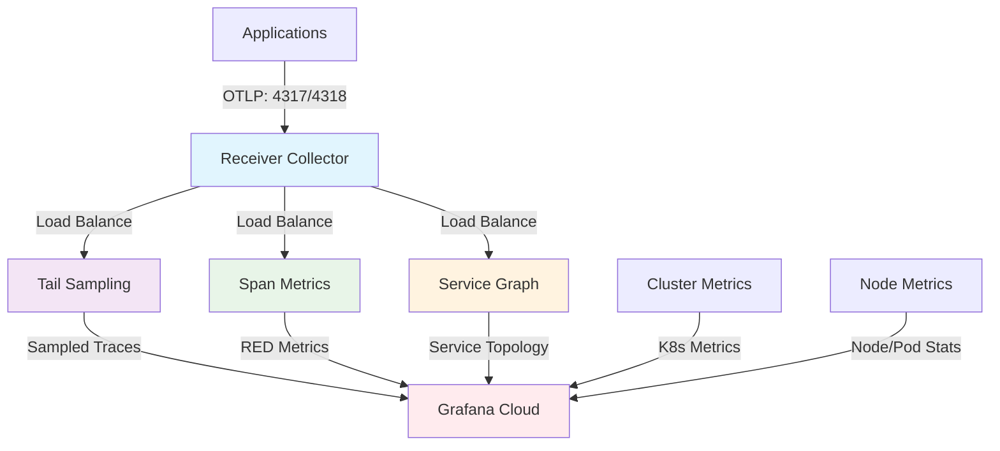

# OpenTelemetry Collector Stack Helm Chart

This Helm chart deploys a complete OpenTelemetry Collector stack for Kubernetes observability with Grafana Cloud integration.

## Architecture



- **Application Collectors**: Process traces and generate metrics
  - `collector-receiver` - OTLP trace receiver and load balancer
  - `collector-tailsampling` - Probabilistic trace sampling  
  - `collector-spanmetrics` - Generate RED metrics from traces
  - `collector-servicegraph` - Generate service topology metrics

- **Infrastructure Collectors**: Monitor Kubernetes infrastructure
  - `collector-k8s-cluster` - Cluster-wide metrics (StatefulSet)
  - `collector-k8s-nodes` - Node-level metrics (DaemonSet)

## Prerequisites

- Kubernetes 1.28+
- Helm 3.15+
- Grafana Cloud account with OTLP endpoint

## Installation

1. **Create namespace:**
```bash
kubectl create namespace o11y
```

2. **Create Grafana Cloud secret:**
```bash
kubectl create secret generic dv-grafanacloud-auth \
  --from-literal=stack_username="YOUR_USERNAME" \
  --from-literal=stack_password="YOUR_PASSWORD" \
  -n o11y
```

3. **Add dependencies:**
```bash
helm dependency build
```

4. **Install chart:**
```bash
helm install otel-stack . -n o11y \
  --set global.clusterName="your-cluster-name" \
  --set grafanaCloud.endpoint="https://your-grafana-endpoint/otlp"
```

## Configuration

### Key Values

| Parameter | Description | Default |
|-----------|-------------|---------|
| `global.clusterName` | Kubernetes cluster name | `monitoring-aks-01` |
| `global.environment` | Environment identifier | `production` |
| `grafanaCloud.endpoint` | Grafana Cloud OTLP endpoint | `https://otlp-gateway-prod-eu-west-3.grafana.net/otlp` |
| `grafanaCloud.authSecretName` | Secret containing Grafana Cloud credentials | `dv-grafanacloud-auth` |

### Allowlists

Metric filtering is controlled by allowlists in the `allowlists/` directory. Enable/disable specific metric sources:

```yaml
allowlists:
  cadvisor:
    enabled: true      # Container metrics
  kubelet:
    enabled: true      # Kubelet metrics  
  kubeStateMetrics:
    enabled: true      # K8s API metrics
  nodeExporter:
    enabled: true      # Node hardware metrics
  kubeletstats:
    enabled: true      # Real-time node stats
  otelCollector:
    enabled: true      # Collector self-monitoring
```

### Application Collectors

```yaml
application:
  receiver:
    enabled: true
    replicas: 1
  tailSampling:
    enabled: true
    replicas: 2
    samplingRate: 0.5  # 50% sampling
  spanMetrics:
    enabled: true
    replicas: 2
  serviceGraph:
    enabled: true
    replicas: 2
```

### Infrastructure Collectors

```yaml
infrastructure:
  cluster:
    enabled: true
    mode: statefulset
    replicas: 1
  nodes:
    enabled: true
    mode: daemonset
```

## Monitoring

Each collector exposes metrics on port 8888:

```bash
kubectl port-forward -n o11y svc/otel-stack-collector-receiver 8888:8888
```

## Uninstalling

```bash
helm uninstall otel-stack -n o11y
```